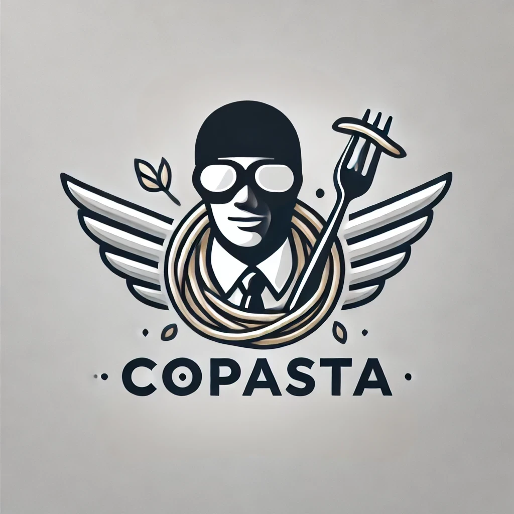

# copasta

```bash
$ npx copasta my-special-button
```

[](https://badge.fury.io/js/copasta)

copasta is a CLI tool that helps you create a new boilerplate for your project. Your own private copilot that copy-pastes code for you. As of now, it supports creating opinionated boiler-plates for React, in the future, it will support custom templates so you can create your own boiler-plates.



